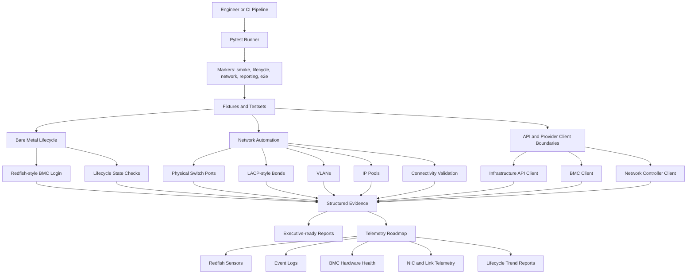

# MetalShift Architecture Diagram

```mermaid
flowchart TB
    CI["Engineer or CI Pipeline"] --> Runner["Pytest Runner"]
    Runner --> Markers["Markers: smoke, lifecycle, network, reporting, e2e"]
    Markers --> Fixtures["Fixtures and Testsets"]

    Fixtures --> BareMetal["Bare Metal Lifecycle"]
    Fixtures --> NetAuto["Network Automation"]
    Fixtures --> ClientBoundaries["API and Provider Client Boundaries"]

    BareMetal --> BMCLogin["Redfish-style BMC Login"]
    BareMetal --> StateChecks["Lifecycle State Checks"]

    NetAuto --> SwitchPorts["Physical Switch Ports"]
    NetAuto --> Bonds["LACP-style Bonds"]
    NetAuto --> VLANs["VLANs"]
    NetAuto --> IPPools["IP Pools"]
    NetAuto --> Connectivity["Connectivity Validation"]

    ClientBoundaries --> ApiClient["Infrastructure API Client"]
    ClientBoundaries --> BmcClient["BMC Client"]
    ClientBoundaries --> NetworkClient["Network Controller Client"]

    BMCLogin --> Evidence["Structured Evidence"]
    StateChecks --> Evidence
    SwitchPorts --> Evidence
    Bonds --> Evidence
    VLANs --> Evidence
    IPPools --> Evidence
    Connectivity --> Evidence
    ApiClient --> Evidence
    BmcClient --> Evidence
    NetworkClient --> Evidence

    Evidence --> Reports["Executive-ready Reports"]
    Evidence --> Roadmap["Telemetry Roadmap"]
    Roadmap --> Sensors["Redfish Sensors"]
    Roadmap --> Events["Event Logs"]
    Roadmap --> Health["BMC Hardware Health"]
    Roadmap --> Links["NIC and Link Telemetry"]
    Roadmap --> Trends["Lifecycle Trend Reports"]
```
