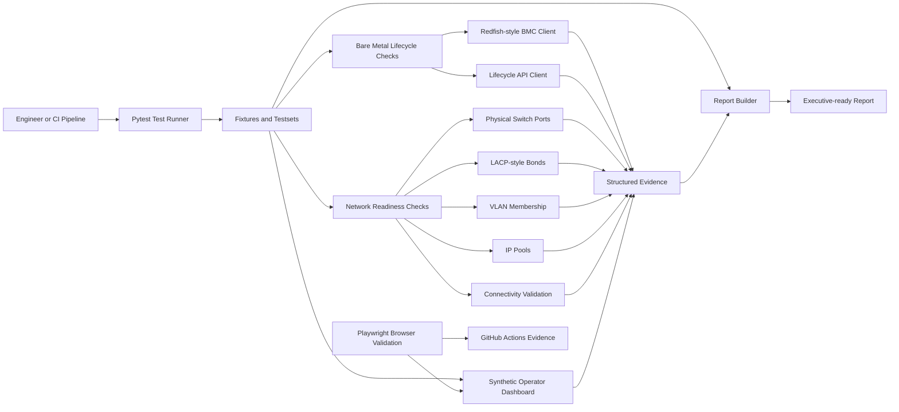

# MetalShift Architecture

MetalShift separates orchestration, clients, network validation, and reporting
so each layer can evolve independently. The public showcase focuses on clear
boundaries rather than vendor-specific integrations.

## Design Goals

- Keep infrastructure workflows testable with standard pytest conventions.
- Model bare metal and network lifecycle state in small, readable objects.
- Isolate external calls behind client boundaries that can target mocks,
  simulators, or real providers.
- Treat networking as part of lifecycle readiness, not as a separate afterthought.
- Generate concise summaries suitable for technical review and executive updates.

## Component View

## Key Layers

**Test orchestration:** Pytest markers group fast smoke checks, lifecycle tests,
network validation, reporting tests, and end-to-end flows.

**Client layer:** API clients hide provider details. The same test logic can
target mocks, simulators, or real services through configuration.

**Lifecycle layer:** Bare metal checks validate management access and workflow
preconditions before higher-risk actions run.

**Network layer:** Switch ports, bonded links, VLANs, IP pools, and connectivity
checks are validated alongside server readiness.

**Reporting layer:** Results are collected as structured evidence and converted
into concise summaries for engineering handoff, release review, or leadership
updates.

**Presentation and browser-validation layer:** A dependency-free HTTP dashboard
projects MetalShift's synthetic environment inventory into operator-facing
readiness evidence. Playwright checks the rendered status, asynchronous API data,
semantic roles, and screenshot output in a real Chromium browser.

**CI quality layer:** Ruff and MyPy guard maintainability while PyTest runs
unit, network, lifecycle, reporting, and end-to-end checks across supported
Python versions. JUnit XML, screenshots, and browser traces are retained as
reviewable build evidence.

## Extensibility

The architecture is designed for pluggable providers. New BMC implementations,
network controllers, inventory sources, or report exporters can be added behind
the same public test workflow.
